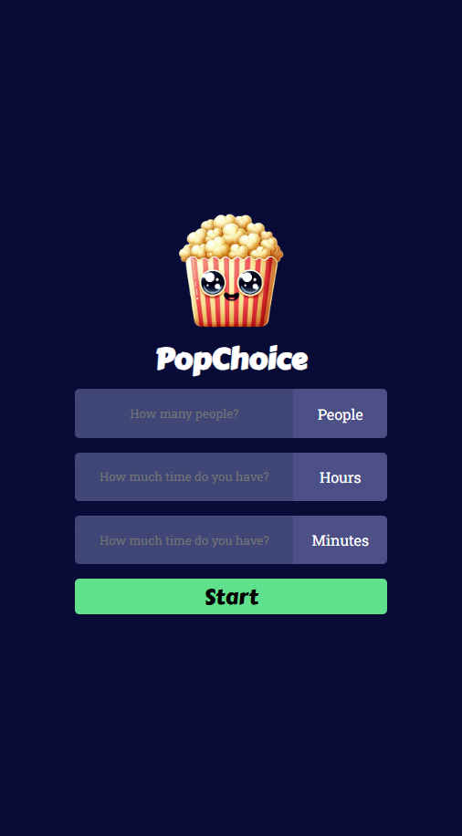
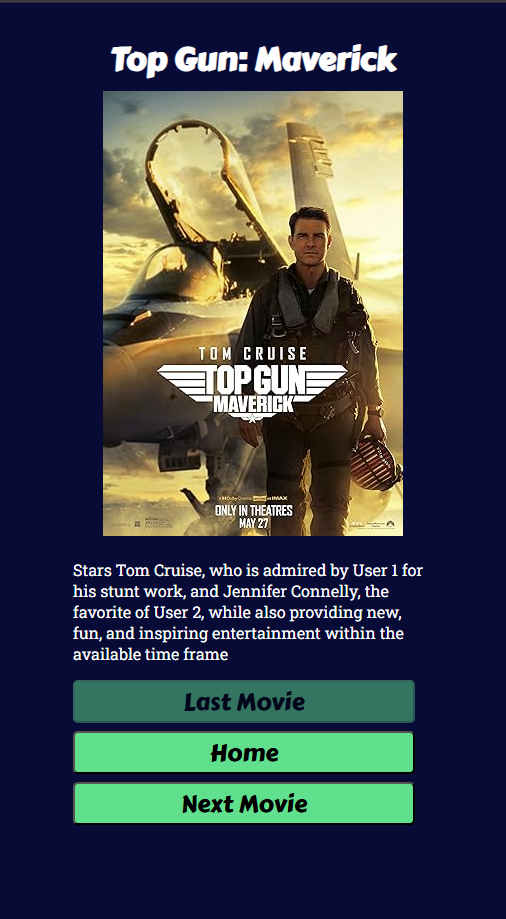

# Movie Recommender
A movie recommender that is powered by [OpenAI](https://platform.openai.com/docs/api-reference/introduction), [Supabase](https://supabase.com/docs)  and [OMDB](https://www.omdbapi.com/).

    
    
    
    

## Get started
Visit the application [here](https://movie-recommender-51m.pages.dev/)

## Implementation
* It features a simple demonstration of the application of ***Retrieval-Augmented Generation (RAG)***.
    - A text database consisting of a list of movies along its description are first chunked, converted into embeddings (using OpenAI's embedding model) and then saved in a vector database hosted by supabase.
    - After filling in the forms stating user's preferences and available time, embeddings that are most similar to user's query will be retrieved and sent as a contet to an OpenAI's GPT model.
    - The GPT model will analyze and provide reasons why such movie are recommended.
    - The movie and the recommendation are then rendered on the page.

